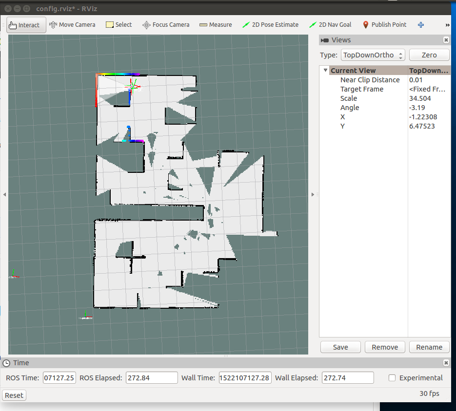

# PS5_MapMaking_and_Odom

Justin Beiriger, jwb153

The screenshot of the map in RVIZ is attached as a separate file and displayed below. Note that I did not command the STDR to traverse the entire world; rather, I instructed it to travel through the maze to the top left and record the map that it detects on the way.

Within the .yaml file, there are several values. The image name points to the name of the file that contains the map image. The threshold values are used by planning algorithms to decide whether a cell is to be called occupied or vacant. The resolution, which is 0.050, is the smallest distance that can be identified between 2 points on the map. THe origin is the location where the robot began recording values to store in the map. 

According to odometry, the map is 13.75 m tall (y-direction) and 9.85 m wide (x-direction). When looking at the STDR maze on a computer screen, the +x direction on the map is to the left, the +y direction is down, and heading 0 is pointing straight up. These directions were determined by manually moving the map around and observing how the view parameters changed. 
